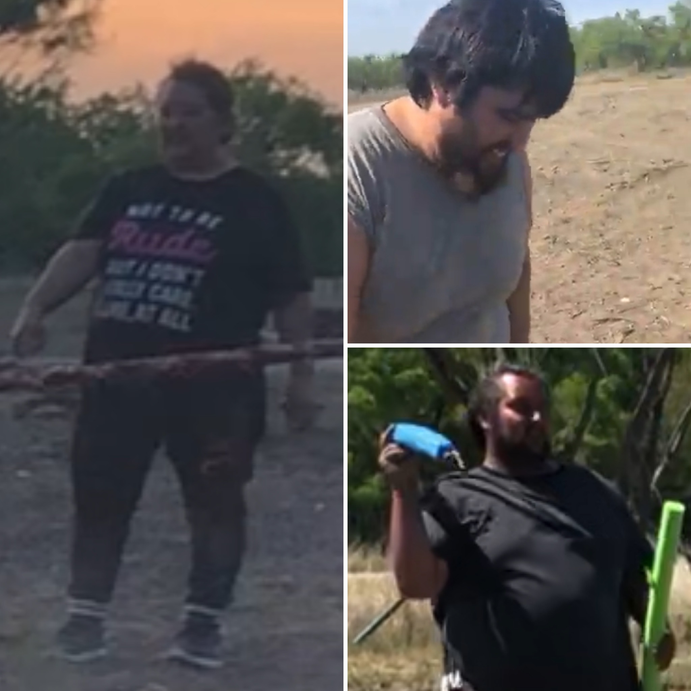

# Obstacle Course

---

(March 31st, 2018)

---

## Description

Open call made out to any competitor wanting to test their physical and mental fortitude. Competitors went head-to-head in different heats. Contestants could go more than once, but only their first attempt would be their official time. Obstacles included competitors to show off their strength, speed, endurance, balance, ingenuity, heart, and determination to complete the course. Completion times varied from 20 minutes to over an hour from start to finish. At the end, there was a special challenge made for teams of 3 where individuals had to get across as a team where one could not hear, one could not speak, and one could not see.

---

## Winner(s)

  

    
    

      Art
    

  

  
 
    

      Jasmin
    

  

  
 
    

      Team FAT
    

  

Males: Art with time of 20:03

Females: Jasmin with time of 38:30

Teams: Team FAT (Marisa, Tony, Joey) with time of 28:04

---

<figure>

<iframe width="560" height="315" src="https://www.youtube.com/embed/L9Ejafc20YI" title="YouTube video player" frameborder="0" allow="accelerometer; autoplay; clipboard-write; encrypted-media; gyroscope; picture-in-picture" allowfullscreen></iframe>

  <figcaption style="font-family: 'Papyrus'; margin-bottom: 0em; font-size: 1em">We see Jasmin Vs. Martha while reporter Frank interviews Art whom holds the fastest time</figcaption>
</figure>
