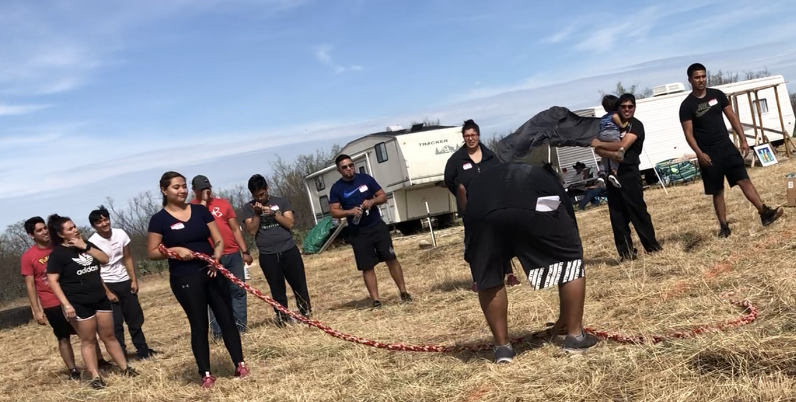
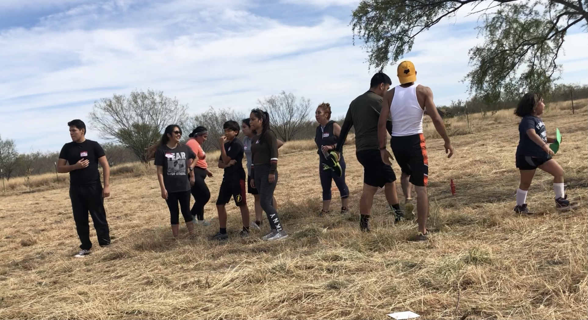
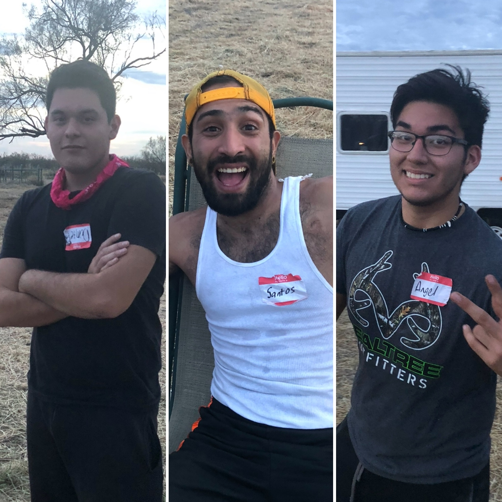

# Season 1

---

(November 24th, 2018)

---

## Description

Challengers from all over were summoned to come and compete in this epic, yet unknown social experiment. 20 brave souls arrived and were up for the challenge. On site, they were placed in teams and asked to work with and trust strangers. The set up was that after every challenge, contestants were then nominated to go head-to-head on a one-on-one elimination every round: loser sits out, winner continues to compete. After many twists and turns of The Games, we had 3 finalists run an intense final. First winner for Razo Ranch: The Games was crowned.

---

## Meet The Cast

<figure>

<figcaption style="font-family: 'Papyrus'; margin-bottom: 0em; font-size: 1em">Frank, Jackie, Elias, Martha, Gera, Angel, Art, Zam, Dark, Rolando</figcaption>
</figure>
<figure>

<figcaption style="font-family: 'Papyrus'; margin-bottom: 0em; font-size: 1em">Dante, Crystal, Alma, Chris, Jasmin, Yessica, Mirna, Erik, Santos, Arlene</figcaption>
</figure>

---

## Finalists

<figure>

<figcaption style="font-family: 'Papyrus'; margin-bottom: 0em; font-size: 1em">Dante, Santos, Angel</figcaption>
</figure>

---

## Winner

Dante

