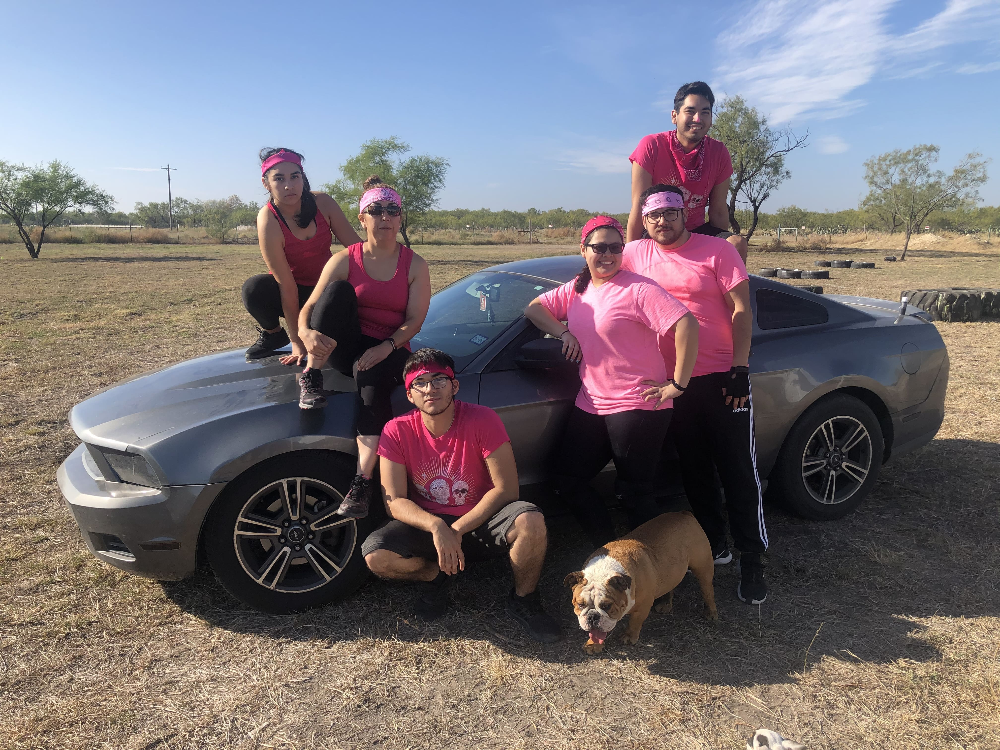
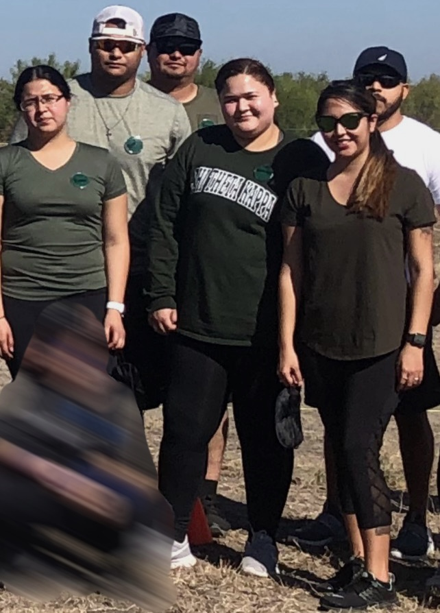
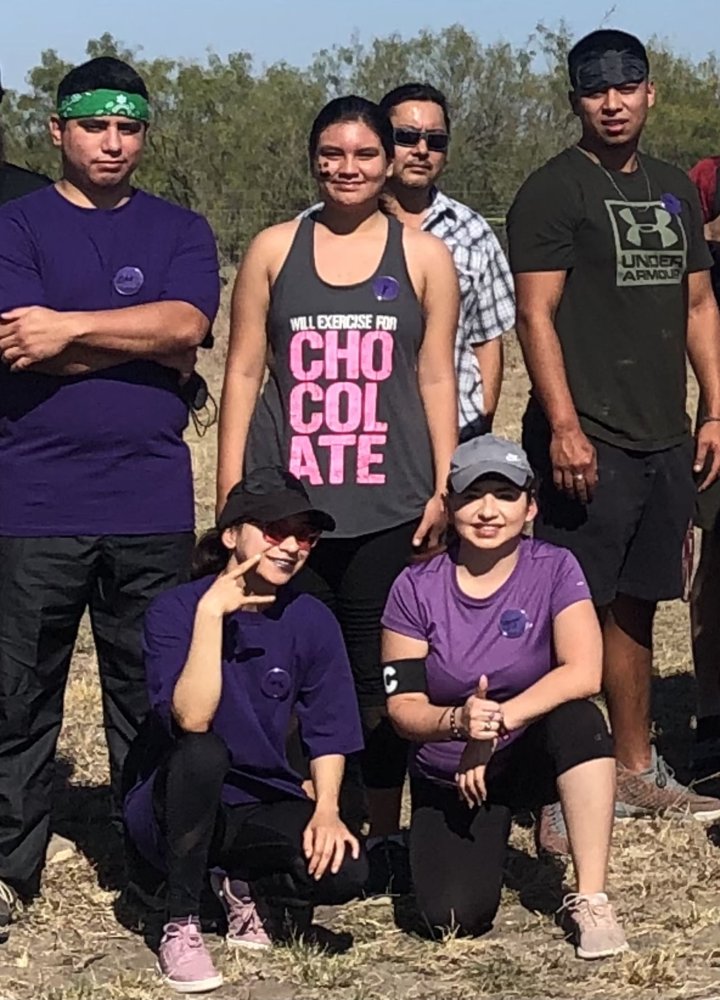
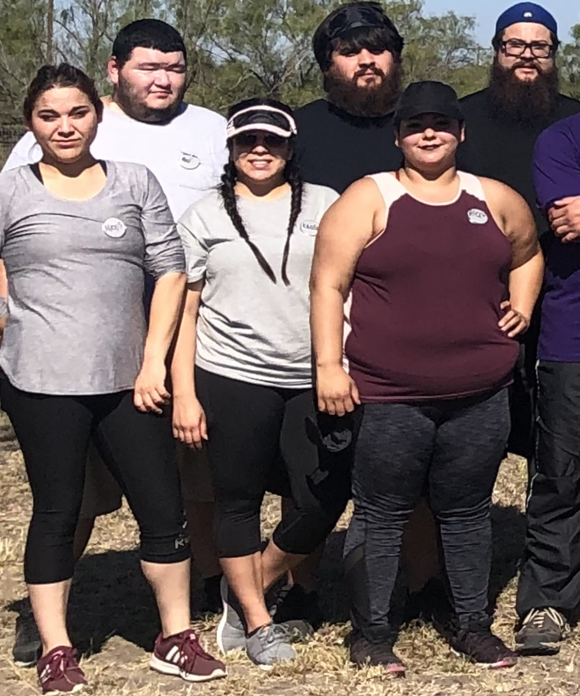
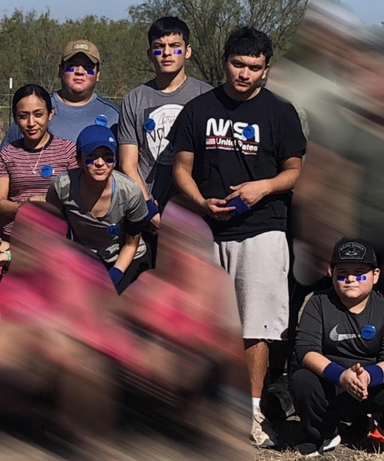
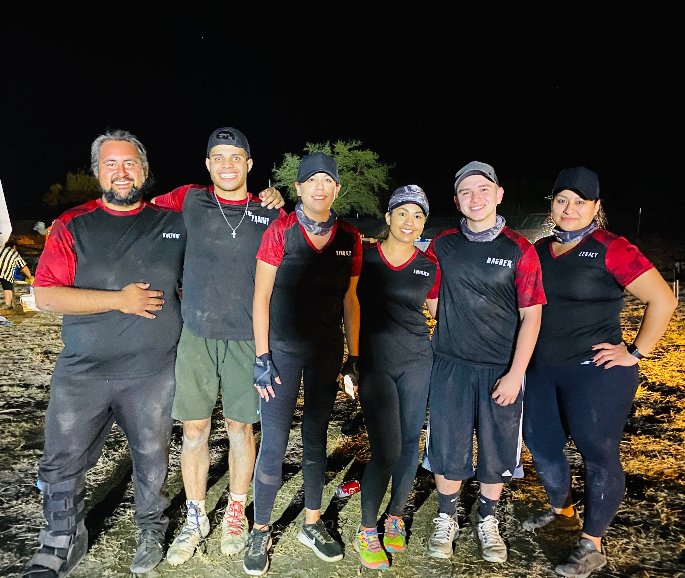

# Season 3

---

(November 30th, 2019)

---

## Description

Contestants were asked to submit captain submissions. 3 males and 3 females were selected as captains. They were asked to recruit and complete a team of 3 males and 3 females (including themselves). The captains recruited their team and showed up ready to compete. Right before the games began, a surprise 7th team of 6 joined the game, making it a total of 42 contestants. After every challenge, there was both a male and female head to head elimination where the winner(s) rejoined the game in their prospective teams. After a long day of battles, 10 contestants attempted the final. One gladiator became victorious amongst all the other competitors.

---

## Meet The Cast

<figure>

<figcaption style="font-family: 'Papyrus'; margin-bottom: 0em; font-size: 1em">Team Chaos joins the rest of the cast as a surprise 7th team to stir up the pot</figcaption>
</figure>

  

    
    

        Pink Panthers
    

  

    

    
    

      Fallen Blades
    

  

    

    
    

      Green Team
    

  

  

    
    

    Honey Badgers
    

  

  

    
    

    Storm Team
    

  

    

    
    

    Blue Team
    

  

    

    
    

    Team Chaos
    

  

---

## Finalists

---

## Winner

<figure>

<figcaption style="font-family: 'Papyrus'; margin-bottom: 0em; font-size: 1em;">Chris</figcaption>
</figure>
