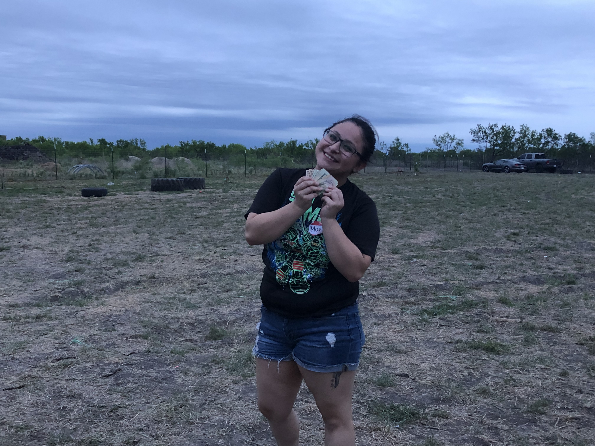

# Season 2

---

(March 30th, 2019)

---

## Description

Challengers were recruited to come compete once again. This time around, the theme seemed to be vets vs rookies. Contestants were encouraged to start mind games even prior to the actual competition. Friendships and rivalries were born. Day of the competition, the first surprise was revealed that Razo Ranch: The Games Season 2 was going to be partners. Based on their qualification times, the male contestants were asked to pick a female partner based on their timed players card (without contestants name). 14 teams were made and the competition began. After every challenge, there was an elimination. Males went head to head against males and females went head to head against females. Winning contestants rejoined the games with their partners or as a new couple depending on the outcome of the elimination challenge. After a hard battle, 3 teams made it to the finals, where they were reminded about it being an individual competition. Every person for themselves, one winner was crowned victorious amongst the other 27 participants.

---

## Meet The Cast

<figure>

<figcaption style="max-width: 34rem; font-family: 'Papyrus'; margin-bottom: 0em; font-size: 1em"><b>Top Row:</b> Art, Sebastian, Miguel, Xian, Miguel, Frankie, Dark, Mando, Erik, Ceasar, Angel</figcaption>
<figcaption style="max-width: 34rem; font-family: 'Papyrus'; margin-bottom: 0em; font-size: 1em"><b>Middle Row:</b> Nat, Maria, Norma, Lupita, Yessenia, Esme, Jackie, Crystal, Jasmin, Tony</figcaption>
<figcaption style="max-width: 34rem; font-family: 'Papyrus'; margin-bottom: 0em; font-size: 1em"><b>Bottom Row:</b> Ailen, Jennifer, Lety, Mirna, Dante, Emily, Arlene</figcaption>
</figure>

---

## Finalists

<figure>

<figcaption style="font-family: 'Papyrus'; margin-bottom: 0em; font-size: 1em">Art, Yessenia, Xian, Maria, Esme, Ceasar</figcaption>
</figure>

---

## Winner

<figure>

<figcaption style="font-family: 'Papyrus'; margin-bottom: 0em; font-size: 1em;">Maria</figcaption>
</figure>
